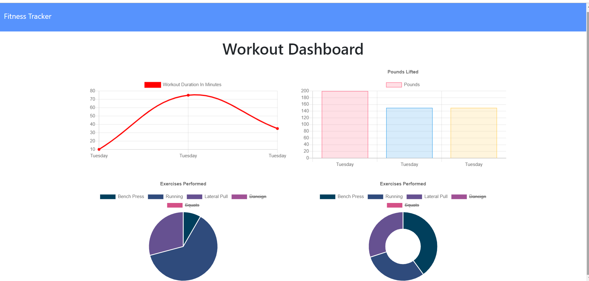

# fitness-tracker


[](https://opensource.org/licenses/MIT)

This is a simple application that allows you to organize and keep track your workouts. YOu can add workouts and see the total weight carried and the total distance traveled. Based on whether you do resistance or cardio the data accumulates so that you can see your progress


## Installation

 First you want to clone this repository into your system

  ```
  git@github.com:EajayD/fitness-tracker.git
  ```

  Then you want to install the npm package 

  ```
  npm i 
  ```

  Once you have the node modules you can run the command below in your terminal to initiate the program

  ```
  node server.js
  ```

  Then head over to <a href = "http://localhost:3000">http://localhost:3000</a> and get started with your fitness tracking

## Usage

Alternatively you can click this live deployed link powered be Heroku to get started

<a href ="https://still-sands-72257.herokuapp.com/">https://still-sands-72257.herokuapp.com/</a>

Below is a preview of what to expect on your fitness tracking journey



## Built With

* [HTML](https://developer.mozilla.org/en-US/docs/Web/HTML)
* [CSS](https://developer.mozilla.org/en-US/docs/Web/CSS)
* [Git](https://git-scm.com/about)
* [Github](https://github.com/)
* [Javascript](https://developer.mozilla.org/en-US/docs/Web/JavaScript)
* [MongoDB](https://www.mongodb.com/)
* [Node.js](https://nodejs.org/en/docs/)
* [Expressjs](https://www.npmjs.com/package/express)
* [Heroku](https://devcenter.heroku.com/)


## Authors

* **Eajay Delos Santos** 

    - [Link to Github](https://github.com/EajayD)
    - [Link to LinkedIn](https://www.linkedin.com/in/eajay-delos-santos-912950214/)

## License
  
 [MIT License](https://opensource.org/licenses/MIT)
  
  ---
